# How to install Windows XP on your Original Apple TV
Installing Windows XP on the Apple TV is quite a bit more difficult than installing it on most other hardware for various reasons. There are 2 ways to do this: the easy way and the hard way.

## The easy way
If you just want to see Windows run on your TV, you can just [download a pre-installed image from archive.org](https://archive.org/details/apple-tv-windows-xp-full.img). However, there are a few disadvantages to doing this:
* This image teaches you absolutely nothing.
* It's already installed and slightly used by me, meaning that some of my configuration is on there.
* I might not update this image as often as I update the other components since regenerating it is a pain.

To use this image, simply download it, extract it, connect your Apple TV's drive to your computer using a USB to IDE adapter (a bootable USB will not, and will never, work, due to the complexity of writing my own USB stack from scratch), and use a tool like `dd`, `gnome-disks` or Etcher to restore the image to the TV's hard drive. Windows should then boot on your TV. Huzzah!

## The hard way (AKA creating your own image)
This method of installing Windows is quite a bit more involved than the previous method. You will need the following items:

* Mac or PC with at least 20GB of free space (Linux-based computer recommended)
* A second computer with Windows XP already installed (don't worry, we won't be erasing this one)
* USB to IDE adapter and IDE hard disk (a bootable USB will not, and will never, work, due to the complexity of writing my own USB stack from scratch)
* QEMU for your computer's OS 
    * For macOS, use [Homebrew](https://brew.sh)
    * For Linux, use your system's package manager
    * For Windows, use [Stefan Weil's binaries](https://qemu.weilnetz.de/w64/) (apparently, I've never used QEMU on Windows)
* A Windows XP ISO
* A copy of the NTATV Drivers and Utilities ISO (see [Releases](https://github.com/DistroHopper39B/NTATV/releases/))

First, we need a virtual hard disk image. We will restore this to the Apple TV's hard drive once the install completes. To create one, use the `qemu-img` command-line utility like this:
```
qemu-img create appletv_windows.img 30G
```
This will be the amount of space available to Windows. You can resize the OS to fit the full size of your Apple TV's hard drive later. Ensure the size is lower than your hard drive's stated capacity by a few gigabytes as shrinking the disk image is difficult.

Now that your hard drive image is created, we need to start the install of Windows XP. Run the following command:
```
qemu-system-i386 -enable-kvm -m 2048 -hda appletv_windows.img -cdrom /path/to/windowsxp.iso -boot d -device usb-ehci,id=ehci -device usb-kbd
```
For macOS, replace `-enable-kvm` with `-accel hvf` and `qemu-system-i386` with `qemu-system-x86_64`.  For Windows, there are a few ways to set hardware accelerated virtualization up. I've never used QEMU on Windows, so you can look it up. Alternatively, you could use VirtualBox for the install, but if you do, **you must enable PAE/NX in VirtualBox settings. IF YOU DON'T YOU WILL REGRET IT. DON'T ASK ME HOW I KNOW THIS, AND DON'T ASK ME HOW MANY MONTHS I WASTED ON THIS PROJECT UNTIL I FIGURED THIS OUT.**

Once you get to the partition list, instead of pressing Enter like usual, press C to create a new partition. Make your new partition at least 20MB smaller than the full size of the disk; I usually leave a bit more room than that.

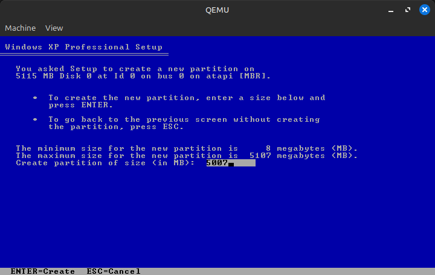

Then, create a partition on the remaining space. By the end, your partition map should look something like this:

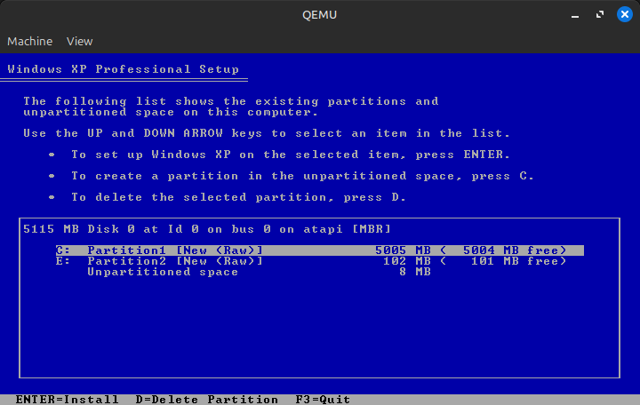

Now, you can install to the larger partition and go through the installation as normal. This should only take a few minutes unless you type in your product key incorrectly 37 times.

Once XP is installed, navigate to File Explorer and format the extra partition we created as FAT32 (use Quick Format). This will act as the EFI system partition and is where the bootloader will be stored. Once you do that, shut down the system.

Back on the host system's command line, we now need to swap out the CDROM from the Windows XP ISO to the NTATV Drivers and Utilities ISO. We also need to tell QEMU to boot from the hard drive instead of the CD-ROM. The QEMU parameters should look like this:
```
qemu-system-i386 -enable-kvm -m 2048 -hda appletv_windows.img -cdrom /path/to/ntatv_drivers_and_utils.iso -boot c -device usb-ehci,id=ehci -device usb-kbd
```

Open the CD in Explorer and double click on the `HDDFix` registration entries. When prompted click "Yes" and you should see "Information from HDDFix.reg has been entered into the registry".

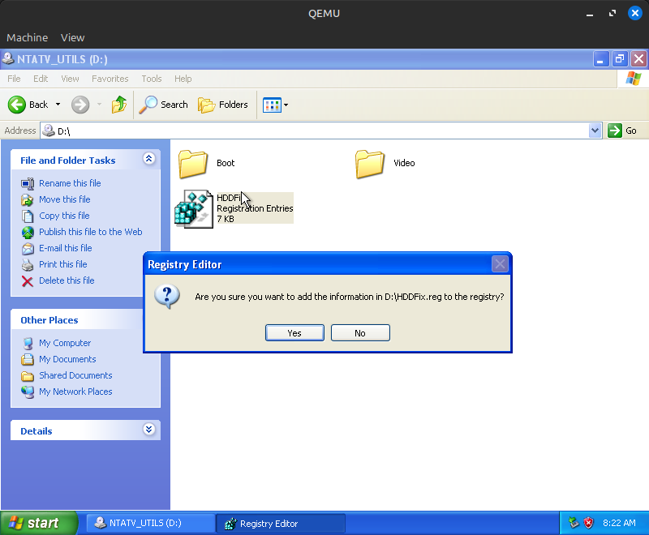

Drag the contents of the `Boot` folder to the FAT32 partition we just created.

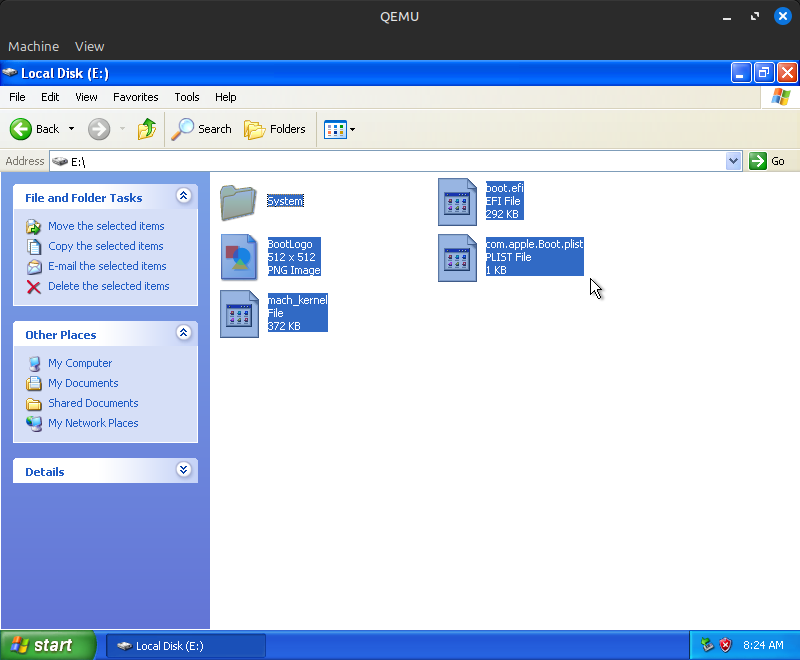

Drag `freeldr.ini` to the root of the `C:` drive.

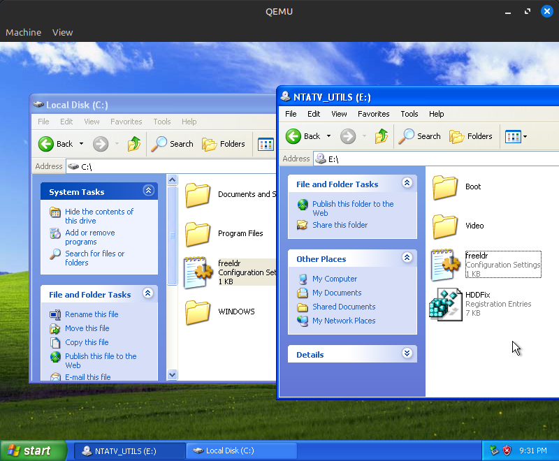

Now it's time to set up the video driver. Open the Device Manager, right click on "Video Controller (VGA Compatible)", and select "Update Driver...". Select "No, not this time", then "Install from a list or specific location (Advanced)", then include the `D:\Video` location in the search.

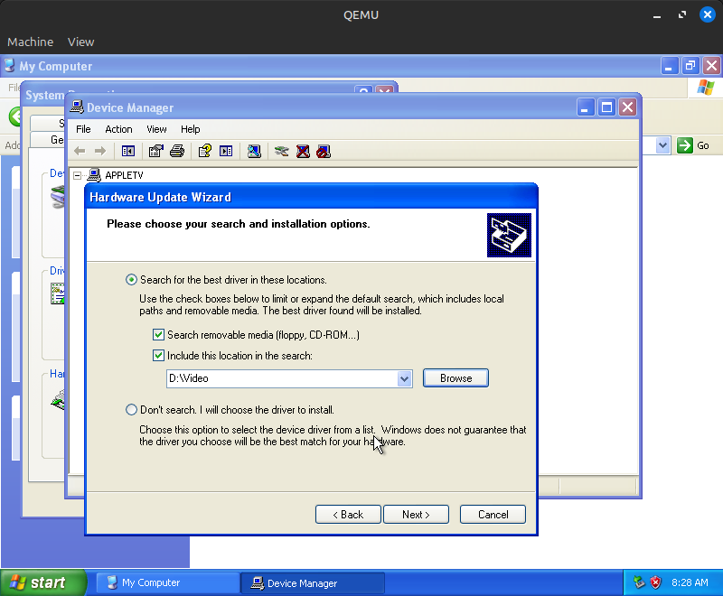

Select "Continue Anyway", then when prompted for the Windows XP CD-ROM click "OK". Go to "Browse..." and go to `D:\Video` for the additional file (`BOOTVID.DLL`). This 

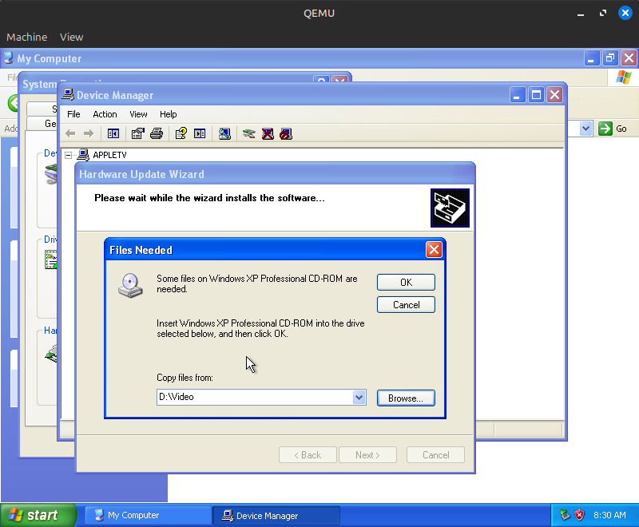

You will get to a screen stating "This device cannot start. (Code 10)." This is normal. Click Finish, then close out of Device Manager.

Now, shut down your computer and restore the appletv_windows.img to an IDE hard drive using a hard drive flashing tool of your choice (DD, Etcher, GNOME Disks). Once the restore is complete, mount the Windows XP ISO on your host machine and navigate to the `I386` directory, then extract `PCIIDE.SY_` to `pciide.sys` using either Windows' `expand` command line utility or 7-Zip/p7zip. `pciide.sys` should be placed in the Apple TV hard drive `\WINDOWS\system32\drivers`; ensure the file name is in all lowercase.

Now, connect the Apple TV's hard drive to the secondary computer already running XP. It is possible to do this using another VM and passing through the hard drive as either an IDE disk or USB device, but using another computer is easier. On your other computer, open Registry Editor, click on the `HKEY_LOCAL_MACHINE` folder, then go to `File -> Load Hive`.

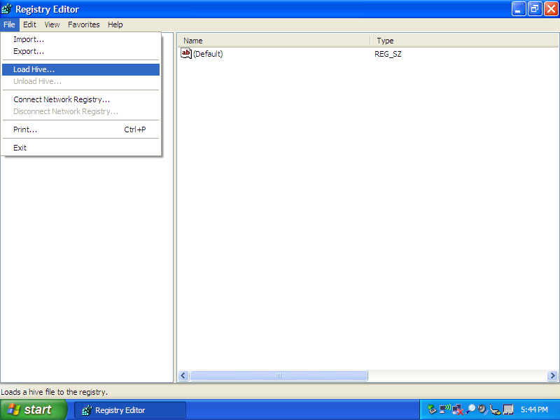

It will ask you to select a hive; navigate to your Apple TV XP install `\WINDOWS\system32\config` and select the `system` file.

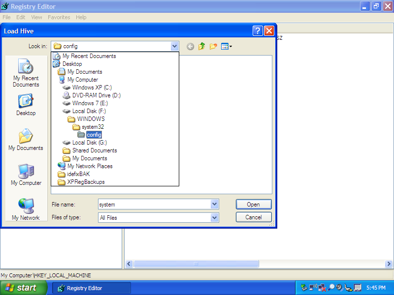

When asked, name the key `SYSTEM_TV`. Once you do that open `SYSTEM_TV\ControlSet001`, then right click on `Enum` and select `Permissions...`. Enable full control for Everyone.

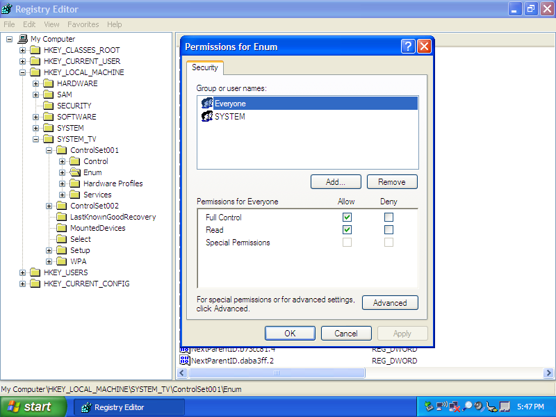

Now, right click on `Enum` again and select `Delete`. You'll get an `Error while deleting key` error, this can be safely ignored. Go back to `SYSTEM_TV` and go to `File -> Unload Hive`, then safely eject the hard drive from the system.

Place the hard drive into the Apple TV, but don't reassemble it; we'll need the drive back in a few minutes. Plug in your TV, connect a keyboard and mouse to it, and within about a minute, you should see the glorious NTATV logo, followed by FreeLoader and the Windows XP logo! The system will hang for several minutes; it needs to reenumerate all system devices, which takes a while. You'll hear the hard drive spinning for several minutes, then the system might reboot, or it might hang infinitely (there is no consistency as to what it does). Either way, after the hard drive stops spinning, the Apple TV reboots, or about 5 minutes have elapsed, remove the hard drive and connect it back to the Windows XP computer.

Open `regedit` again and mount the hive again. Go to `ControlSet001\Control\Enum\PCI`, then select what should be the first entry in that list (the entry starts with `VEN_10DE`). Navigate to the key (folder) inside of that key (should be a string of mostly numbers with some letters and ampersands).

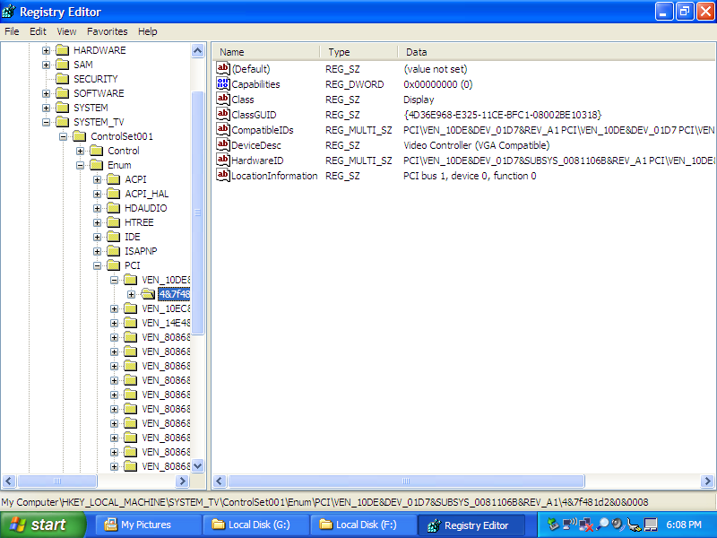

Now, we need to manually enumerate these entries. This part of the installation process cannot easily be scripted because the "string of mostly numbers..." is different on every Windows install. The contents of your key **must match the below screenshot exactly**; most of the entries are present, but `ConfigFlags`, `Driver`, `Mfg` and `Service` must be created manually. By the end, the contents should look exactly like this:

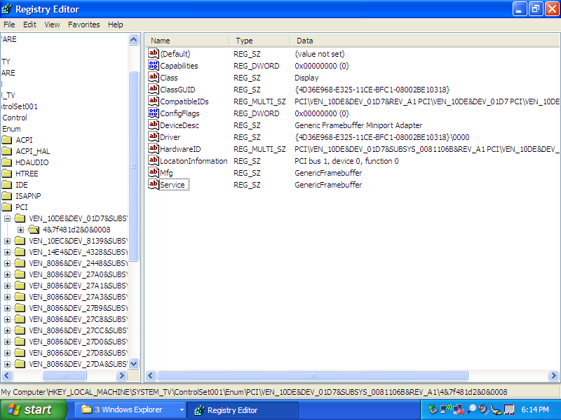

*Tip: `ClassGUID` and `Driver` have the same UUID, so there's no reason to type it in manually; just copy/paste the value then add `\0000` to the end of it.*

Congratulations, if you did everything right, you successfully set up Windows XP on your Apple TV! Now it's time to test it out. Unload the hive and disconnect the drive as before, then put the Apple TV back together. You should get to the desktop!

## Installing Drivers
### Sound and WiFi
"The Easy Way" already has drivers installed minus the remote driver. For "The Hard Way", however, very few drivers for the hardware are present. The RTL8139 Ethernet controller works out of the box, but the sound and WiFi require the installation of drivers from [Boot Camp 3.1.1](https://archive.org/details/boot-camp-3.1.1). Running the main `setup.exe` will not work, but WiFi will work if you run `Boot Camp\Drivers\Broadcom\BroadcomNetworkAdapterXP.exe`, and audio will work if you run `Boot Camp\Drivers\RealTek\RealtekSetupXP.exe`. I haven't tested the chipset driver as of yet, but it probably works fine.

The Realtek sound driver utility, an almost useless tool for most people, hogs over 20MB of RAM at idle. I'd recommend disabling it in msconfig.

### NVIDIA graphics
You will need to use the driver from 9/26/2006 at [the Microsoft Update Catalog](https://www.catalog.update.microsoft.com/Search.aspx?q=NVIDIA+GeForce+Go+7300). Setup.exe apparently doesn't work, so you'll need to install it via Device Manager; extract the CAB file, open Device Manager, right click on the display adapter device, select "Update Driver", and install the driver from the location you extracted the CAB to. Reboot the system; do note that the display will completely turn off for 10-15 seconds before the cursor reappears.

For some reason, 3D acceleration is disabled out of the box. Open Display Properties, then go to Settings (you might get an error that will go away the next time you reboot your TV) -> Advanced -> Troubleshoot, then set "Hardware Acceleration" to "Full". Reboot, and you should have GPU acceleration! The NVIDIA control panel also works, but might require another reboot.

By default, the NVIDIA card will steal 64MB of your system RAM for itself through something known as "TurboCache". Unless you really need 128MB of VRAM, I'd recommend disabling this due to the extremely low system RAM in the Apple TV. See [this ancient forum post](https://www.techsupportforum.com/threads/how-to-disable-turbocache.204963/?u=286878&sortby=newest) for instructions on how to do that.

Thank you Guido Lehwalder ([@guidol70@mastodon.online](https://mastodon.online/@guidol70/114043812917235617)) for getting this driver working!

### IR Remote
See https://github.com/DistroHopper39B/NTATV_RemoteDrv. As of now, the driver is useless and just a demo of the software more than anything else, so it's not included with the prebuilt image.

## Optimizing the Boot Speed
When you are booting into Windows, you'll notice a 40-50 second black screen before anything appears on the screen. This is because the Windows HDD is not set as the default boot device in the Apple TV's EFI firmware. To fix this, [reset the PRAM](https://support.apple.com/en-us/102539) by holding Command-Option-P-R on the keyboard for 50 seconds as the Apple TV turns on.

## Troubleshooting
### USB
It's possible that when you boot Windows on your Apple TV for the first time, your keyboard and mouse might not work. To fix this, follow these exact steps
* Connect only the mouse to the Apple TV with no hub.
* Turn on the TV and wait for it to get to the desktop.
* Unplug and replug the mouse **immediately** after booting the system. A mouse cursor should appear a few seconds later. If it doesn't, unplug and replug the Apple TV.
* When the Found New Hardware Wizard appears, very quickly tell Windows not to connect to Windows Update, then tell it to install the software automatically and don't let it connect to the Internet. It will fail, but as long as you don't uncheck "Don't prompt me again to install this software" at the end, it will work.
* Do this repeatedly (I think about 7 times) until the wizard stops appearing.
* Properly shut down the Apple TV. It won't actually turn off, but it will freeze on the shutdown screen and Caps Lock will stop working.
* Boot back up with the keyboard and mouse connected to a USB hub.