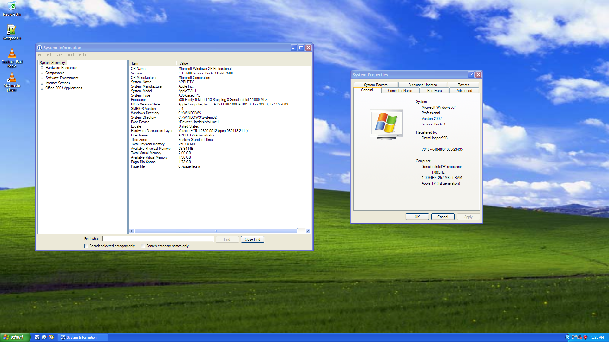

# How I ported Windows XP to the original Apple TV

## Background
The original Apple TV is probably one of the most fascinating devices Apple has ever made. Released in 2007 for $299, it received fairly lukewarm reception and pretty low sales; in fact, the Apple TV made it onto the extremely small list of devices Apple rendered completely useless by [dropping support for in iTunes](https://lowendmac.com/2018/appletv-1st-generation-apples-improper-abandonment-and-what-to-do/). Not even the original 2001 iPod has made it onto this list. The TV was limited in its functionality under its stock OS; it was heavily reliant on a Mac or PC with iTunes, couldn’t access normal AFP or SMB shares to play media from a home server, and couldn’t play media from USB devices despite having a singular exterior USB 2.0 port “for service and diagnostics”.

So why is a device left for dead by Apple so interesting to me?
		
[It has an Intel processor.](https://everymac.com/systems/apple/apple-tv/specs/apple-tv-itv-specs.html)

Now granted, it’s not a very fast processor; the TV sports a 1GHz Intel Pentium M CPU with a TDP of about 5 watts. It’s fast enough for the stock Apple TV OS, a modified version of Mac OS X 10.4.7 Tiger (although even that OS is far from snappy, with major lag spikes being common on newer releases), but not much else. The bigger limitation to the speed of the machine is certainly its RAM, however—the TV ships with just 256MB of it, plus 64MB of dedicated VRAM for the actually-somewhat-decent NVIDIA Geforce Go 7300 GPU. But there is one OS that is perfect for those specifications, Windows XP.

Windows XP needs no introduction; it’s one of the most well loved operating systems of all time, and its iconic default Bliss wallpaper might be the most viewed photograph in the world. The Apple TV falls well above [XP’s minimum system requirements](https://en.wikipedia.org/wiki/Windows_XP#System_requirements), with the exception of one: “BIOS or compatible firmware”. 

Yes, being an Apple device with an Intel processor, the Apple TV has [EFI firmware](https://en.wikipedia.org/wiki/UEFI). While it had no direct EFI support, Windows XP was able to run on Intel Macs through something known as CSM, or the Compatibility Support Module. CSM is a firmware feature that allows EFI-based computers to boot legacy BIOS-based operating systems such as Windows XP. However, because the Apple TV never supported any other operating systems, CSM was never implemented into its firmware. This lack of CSM support leaves us with two choices: modify the Apple TV’s firmware to support legacy BIOS operating systems, or modify Windows XP to work on EFI firmware. While modifying the firmware is theoretically possible, it requires external programming and is extremely difficult and complicated, especially with the Apple TV lacking a serial port. That just leaves me with modifying Windows XP to remove the dependencies on legacy BIOS.

Windows XP, or really any pre-8 NT Windows, have three dependencies on legacy BIOS; the bootloader, the fallback video driver, and the MS-DOS compatibility layer. The MS-DOS compatibility layer is not something that’s required to boot Windows (sorry DOS gamers) but the other two are absolutely required. Thankfully, both of those are somewhat easy to get working with the help of ReactOS.

[ReactOS](https://reactos.org) is a fully open-source attempt to re-implement Windows’ kernel and userspace, currently targeting Windows Server 2003 R2. That’s pretty close to XP (if you’re a ReactOS developer, pretend you didn’t hear that). Importantly for us, its bootloader, FreeLoader, can boot Windows 2000, Windows Server 2003, and, yes, Windows XP. It’s also extremely portable, with versions of it existing for the [original Xbox](https://reactos.org/wiki/Xbox_Port), [ARM-based machines](https://reactos.org/wiki/AArch64), and even [NEC PC-98 computers](https://reactos.org/wiki/PC-98). There are also efforts to get ReactOS running on EFI-based machines; most of the development is being done by [Justin Miller (The_DarkFire_)](https://github.com/DarkFire01/) and [Hermès Bélusca-Maïto (hbelusca)](https://github.com/hbelusca/). Since ReactOS is designed to be just like Windows, the steps for getting EFI to work are the same, and I should be able to use its bootloader and drivers on XP, right?

Right?

Well, there’s another major hurdle.

See, the Apple TV was the first Apple device to do any sort of boot-time OS verification. It’s hard to believe, since Apple puts verification on everything that moves now, but this was the very first time they did so. It did this in a very simple way. When you turn on your Apple TV, the firmware checks to see if the EFI file is one signed by Apple (of which there is only a small handful of known files). If it passes that test, the firmware loads it; if it doesn’t, the firmware moves on to the next boot entry. However, Apple did such a poor job of OS verification that in just sixteen days, [the verification was cracked and Edgar (gimli) Hucek booted Linux on the TV](https://sourceforge.net/p/mactel-linux/code/HEAD/tree/trunk/mach_linux_boot/). So, how did he do it?

Well, the verification wasn’t exactly cracked per se, more so bypassed. While the firmware goes to great trouble to verify the bootloader, it doesn’t verify the next stage up—the operating system kernel—at all. [Since the Mac OS X kernel is open source](https://github.com/apple-oss-distributions/xnu), it’s easy enough to see exactly [what parameters are passed into it from the bootloader](https://github.com/apple-oss-distributions/xnu/blob/xnu-1228/pexpert/pexpert/i386/boot.h), and easy enough to give some of that data to another operating system, like Linux—or Windows. Linux loaders for the Apple TV—of which there are three—compile together a binary blob of a Linux kernel, an intitial ramdisk, and a tiny helper program into a statically linked [Mach-O executable](https://developer.apple.com/library/archive/documentation/Performance/Conceptual/CodeFootprint/Articles/MachOOverview.html), the same type used for Mac OS X kernels. The helper program converts the information given by boot.efi (most importantly pointers to machine-specific resources such as the EFI system table and the framebuffer base address, as well as the display geometry) to information Linux can recognize, then sets up and bootstraps the Linux kernel. Removing the hard drive—a 40 or 160GB laptop IDE drive, perfect for Windows XP’s lack of SATA drivers—isn’t even necessary, since the useless USB port (remember it?) can be used to boot USB devices. Running Linux, specifically a distribution with XBMC (now Kodi media center) used to be somewhat popular on these things, since it allowed for playing local media. But by the time the last pre-packaged Linux distribution for the Apple TV, OSMC, [ended support for the device in 2017](https://osmc.tv/2017/09/saying-goodbye-to-apple-tv/), it was almost unusable due to the slowly increasing bloat of software over the years. This is all the more reason to get Windows XP running, though; it opens the TV up to a massive library of software that Linux either can’t run or is too slow to on the TV. Compared to its contemporaries, XP is also very lightweight. So, how are we going to do it?

## The Bootloader
Well, we need a FreeLoader port. Because of the modularity of FreeLoader, [only twenty-eight functions have to be implemented machine-by-machine](https://github.com/reactos/reactos/blob/master/boot/freeldr/freeldr/include/machine.h), and nearly all of mine ended up being based off the preexisting implementations for [EFI](https://reactos.org/wiki/UEFI) and the [original Xbox](https://reactos.org/wiki/Xbox_Port). The hardest part was getting the firmware to actually load it, since FreeLoader, as part of ReactOS, is built using tooling designed for Windows and can’t be easily compiled as a Mach-O executable. I went through a few implementations before landing on the one I actually used, where FreeLoader is compiled as a Windows PE-formatted file then converted to a Mach-O file using a post-compile tool. The only real challenge I faced was getting the hard drive to work. At this point in the boot process, I have no access to firmware commands that would make hard drive access easy, so the only way to get hard drive support is by using a full IDE disk driver. No worries, the original Xbox is the same, so we’ll just use the driver used there right? Well, the driver from the Xbox worked completely fine in the VirtualBox VM that I did the majority of my testing with, but didn’t work at all on real hardware. 

This was a difficult problem to fix, but certainly one of the most fun. See, [PCI IDE controllers have two ways of operating: ISA compatibility mode, and native PCI mode](https://wiki.osdev.org/PCI#Class_Codes). VirtualBox, the original Xbox, and a lot of PCs actually set their IDE controllers to legacy compatibility mode because there aren’t really any major adverse effects to doing so as far as I know. The Apple TV’s controller, though, uses PCI native mode and therefore requires a slightly more robust driver. I could have modified the driver, but instead I opted to instead [just change the mode of the IDE controller](https://github.com/DistroHopper39B/reactos/blob/AppleTV-Desktop/boot/freeldr/freeldr/arch/i386/appletv/appletvdisk.c#L26). There’s little documentation on how to do this, but by changing bits 0 and 2 of the Programming Interface register of the IDE controller, we can put the disk into ISA compatibility mode. This actually worked, and allowed the Apple TV to load the kernels of both ReactOS and Windows. To get much further than this, though, we need proper drivers for the EFI framebuffer. Of course, that means passing through the base address and display geometry to Windows; thankfully, that’s something already covered by the work done for EFI support in ReactOS.

## The Video Driver
This section is known as “The Video Driver”, although saying that there’s just one driver controlling video on Windows would be incorrect. There are actually 2, because Microsoft: one, known as `bootvid.dll`, allows the system to show the graphical boot screen as well as BSODs and a few other things; and the other manages video after the GUI loads. The [EFI-compatible `bootvid.dll`](https://github.com/DistroHopper39B/reactos/blob/AppleTV-Desktop/drivers/base/bootvid/framebuf/bootvid.c) was written by [Hermès Bélusca-Maïto](https://github.com/hbelusca/) and is a drop-in replacement for `bootvid.dll` on ReactOS, Windows XP, and Windows 2003. I never needed to do any debugging for that driver. The GUI graphics driver, [`genfbvmp.sys`](https://github.com/DistroHopper39B/reactos/blob/AppleTV-Desktop/win32ss/drivers/miniport/genfbvmp/genfbvmp.c) (Generic Framebuffer Video MiniPort), is a direct replacement for the fallback VGA driver (`vga.sys`) on ReactOS, which allowed me [to get to the desktop on ReactOS](https://www.youtube.com/watch?v=TPRmmYZr-zQ), but due to ReactOS’ hardware abstraction layer being broken on most real hardware, PCI, and therefore USB, didn’t work. However, on both Windows XP and Windows 2003, I could not get this video driver to work. This was one of the most grueling issues to solve, but at least at this point, I could use VirtualBox.
	
Since I’m working with an EFI framebuffer, the base address and geometry are passed through by the bootloader. Once you’re in Windows, though, there’s a few ways to actually acquire that data. I honestly don’t entirely know how or why any of this works, but the things that are important here are that the driver was acquiring the data twice, one of the ways it acquired the data was a nonstandard method that doesn’t play well with Windows (I think it doesn't play well with upstream ReactOS, either), and the other way was left completely unused by the driver. After patching the driver to get the data in a Windows compatible way, it actually worked, and [I was able to get working video in a virtual machine on Windows!](https://youtu.be/NKXQUTRHJa4)

But wait, I skipped over a few pieces of important information there. It’s hard to really tell this story in proper chronological order because I kind of discovered all of these things simultaneously and somewhat coincidentally. I need to talk about the difference between a Plug-and-Play video driver and a legacy video driver. The only important thing you need to know about legacy video drivers is that they are completely, to my knowledge, undocumented, and the only one in existence is Windows’ fallback VGA driver. I’m not even sure if ReactOS tries to implement legacy video drivers, but if they do, their implementation is incorrect. All other video drivers, including mine, VirtualBox Guest Additions, NVIDIA drivers, ATI drivers, et cetera, are built on the Plug-and-Play architecture. Windows XP has no Plug-and-Play video drivers installed by default, but Windows Server 2003 does. Windows Server 2003 has two implementations of the VGA driver; `vga.sys` and `vgapnp.sys`. Can you guess which one is the Plug-and-Play one? Anyway, in Windows 2003, simply replacing `vgapnp.sys` with `genfbvmp.sys` will allow for working video, but in Windows XP, you have to install the driver using an INF file before using the install on the Apple TV. But if you notice, I haven’t been talking much about real hardware. There’s a reason for that.

## How Windows Decides if your Computer is Worthy
As I expected, getting things to work on real hardware has always been harder than getting them to work on VirtualBox. Debugging is nearly impossible beyond trial-and-error without writing a Kernel Debugger extension driver over Ethernet (KDNET), which I really wanted to avoid doing. The first two issues I had on real hardware were the aforementioned hard disk issue and an issue with ACPI that had to do with me doing memory mapping incorrectly. Those were annoying, especially the second one, but they were fairly simple fixes.

Since the Apple TV has no CD drive and I have no way of booting the XP installer with FreeLoader, I am forced to install Windows in a virtual machine then image it over to the IDE hard drive. As anyone who has ever had to swap a motherboard while trying to keep an old Windows install intact knows, Windows doesn’t really like being moved around very much. It all has to do with how Windows enumerates hardware; basically, at install-time, Windows adds an `Enum` key to the `SYSTEM` hive of the registry and populates it with every device in the system. If this key is deleted, Windows can regenerate most of it. Everything, except for the hard disk information, that is. There is something more powerful than `Enum`, though, and that is `CriticalDeviceDatabase`. 

By adding PCI or Plug-and-Play information to `CriticalDeviceDatabase`, you’re telling Windows that if it sees a device compatible with or identical to the one you added, it will load the driver stated there – or else! By adding IDE hard drive related entries, Windows is forced to use the IDE drivers before checking whether the hard drive is in the correct spot, meaning that the Enum key can be safely deleted and the system’s devices can be re-enumerated. (This isn’t a requirement as far as I can tell, but it definitely reduces clutter!) This is a Microsoft-official solution detailed in now-deleted Knowledge Base article [KB314082](https://www.betaarchive.com/wiki/index.php/Microsoft_KB_Archive/314082), and it’s packaged into [Foolish IT’s FixIDE utility](https://www.d7xtech.com/free-software/fixide/). This allowed me to boot Windows most of the way on real hardware, but the video drivers, even those that were working in VirtualBox, were still broken. I was able to successfully get my USB mouse to light up, though, which means that at least PCI and USB are partially working; however, the caps lock key on my keyboard did not light up.

## Revenge of the HAL
In all the time I spent working with real hardware, I never stopped to check what hardware abstraction layer (HAL) Windows XP was using. The Apple TV, being an EFI-based machine, doesn’t really work correctly with anything using the PIC, or Programmable Interrupt Controller, to manage IRQs—essentially, signals sent to the CPU when a device needs its attention. Not even Linux has proper support for USB when using that controller. Thankfully, the TV contains an APIC, or Advanced Programmable Interrupt Controller, which is a more modern controller with more pins for more interrupts. What I didn’t realize, however, is that for several months of Windows testing I was using the HAL that only supports the PIC. By sheer luck, when attempting to figure out how Windows does device-specific hardware checks, I discovered that these two HALs were different. Immediately, I changed to doing all my installs for real hardware in QEMU; it’s easier that way anyways, since I can use raw disk images or directly install to the hard drive. When I booted Windows with the ACPI APIC HAL, the keyboard's Caps Lock light turned on and off, which means that PCI is working! And when I replaced `vgapnp.sys` with `genfbvmp.sys` in Windows Server 2003, the graphics drivers worked! I could finally fully control the system.

But on Windows XP, things weren’t looking as great. Despite my best efforts, my first attempt at getting video working  led to a thoroughly corrupted registry that led me to write off the install and start again. I realized that for some reason, no matter how correctly I installed `genfbvmp.sys`, Windows would always try to use the fallback video driver instead. Why? 

This was a puzzle at first, but I eventually figured it out. Basically, if a video card is swapped for another video card, Windows will set up that video card to use the fallback driver. This is done to prevent a preexisting vendor video driver from crashing if the user replaces their video card. And in almost every case, this makes perfect sense and causes minimal issues with the user experience. Every case that is, except for the Apple TV.

The Apple TV can’t use the fallback VGA driver, only my Plug-and-Play one. So, how do we solve this? Answer: manually add the driver to enumeration in the registry. Yeah, I was surprised too that this actually worked. But it did, and now Windows XP also works!!! After 778 days of off-and-on work on getting Windows XP to run on the Apple TV, it’s finally complete.