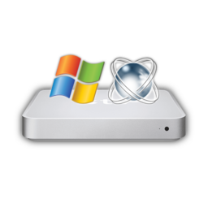

# NTATV
The NTATV Project: Bringing Windows NT (Windows XP, Windows 2003, ReactOS) to the original Apple TV. Created by DistroHopper39B (YouTube: [@DistrosProjects](https://youtube.com/@DistrosProjects), Mastodon: [@distrohopper39b](https://bitbang.social/@distrohopper39b)) with help from several ReactOS devs (see [Credits](#credits))

### Want to run this on your Apple TV? Read the [Guide](Docs/Guide.md)!
### Want to learn how I did this? Read the [Write-Up](Docs/Write-Up.md)!
## Status
Windows XP and 2003 are officially bootable on the original Apple TV! After 2 years of work, enough drivers are working to get both OSes to the desktop. However, due to HAL issues, ReactOS is not usable yet. You can get to the desktop, but there is no PCI or USB functionality.
| Operating System | Kernel | PCI | USB | Basic Video | Accelerated Video | Ethernet | WiFi | RCA Audio | Optical Audio | HDMI Audio | Remote | Reboot/Shutdown |
|:-:|:-:|:-:|:-:|:-:|:-:|:-:|:-:|:-:|:-:|:-:|:-:|:-:|
| Windows XP | Working | Working | Working | Working | Working*** | Working | Working | Partially Working** | Working | Broken | Working | Broken |
| Windows Server 2003 | Working | Working | Working | Working | Untested | Working | Untested | Untested | Untested | Broken | Untested | Broken |
| ReactOS | Working | Broken | Broken* | Working | Broken* | Broken* | Broken* | Broken* | Broken* | Broken* | Broken* | Broken |

*\* Non-working PCI prevents all of these from working.*

*\*\* Audio plays, but at an extremely low volume.*

*\*\*\* Later versions of the driver do not work; see [Guide](Docs/Guide.md#nvidia-graphics)*

## Things that will likely never work
### HDMI audio
The Apple TV uses an extremely weird configuration for HDMI audio in that the Intel chipset, not the NVIDIA video card, is responsible for the audio over the HDMI port. The Intel HDMI audio drivers from the GMA 950 drivers will install, but no devices show up. In order to get this working, I'd need to completely rewrite the Intel HDMI audio drivers to support the Apple TV, which would likely be extremely complicated. If someone wants to work on this, let me know.

### NTVDM
NTVDM on Windows XP requires some legacy BIOS functions (likely the Extended BIOS data area and legacy VGA functions from the GPU) and therefore will not work. Just use DOSBox or [winevdm/otvdm](https://github.com/otya128/winevdm/releases) for old Windows to run DOS/early Windows applications.

## Known Issues
* With the NVIDIA driver installed, if the display goes into standby, unplugging and re-plugging the HDMI cable is required to get a picture. To avoid this issue, set "Turn off monitor" to "Never" in the Power Options Control Panel.
* Component video doesn't work correctly with the NVIDIA driver. Apparently, only the blue component channel is displayed, and attempting to use both HDMI and component video at the same time breaks the system. 
* When using non-English versions of Windows XP, the FreeLoader NTFS driver fails to read the hard drive after installing drivers. Use FAT32 for non-English Windows. See [#9](https://github.com/DistroHopper39B/NTATV/issues/9).
* There is a line of corrupted characters at the bottom the screen at certain resolutions in FreeLoader. This goes away after the Windows kernel begins loading and doesn't affect the desktop.
* RDP connections fail for reasons likely related to the NVIDIA driver.

## Background
Ever since I saw The 8-Bit Guy's video ["Hacking the Apple TV 1st Generation"](https://youtu.be/Q9Acyy9lGSM) back in 2018 or 2019, I have been fascinated with the original Apple TV. I always wondered if it was possible for it to run Windows XP, but my efforts to actually get it working were kickstarted by [this Michael MJD video](https://youtu.be/3rBFkwtaQbU). Pretty quickly afterwards, I got started on hacking my Apple TV, and after over 700 days of on-and-off work, Windows XP finally runs!
### Why this was so complicated
While the Apple TV uses a standard x86 CPU and even an IDE hard drive, its firmware is not compatible with standard Windows XP. Windows XP requires legacy BIOS firmware, while the Apple TV is EFI-only. Not only that, the Apple TV's EFI implementation is *weird* - it can only boot one EFI executable, that being the Apple-official boot.efi. However, hackers very quickly realized that the Apple TV does zero verification on the next stage up in the boot process, that being the Mac OS X kernel file. Within three weeks of the Apple TV shipping, Linux was booted through a custom loader that embeds a Linux kernel into a statically linked Mach-O executable, the same type used by the Linux kernel. Using this concept, we can boot, well, anything on the hardware!

However, Windows is much harder to get running on non-standard hardware than Linux. For one, it's proprietary - when the first Linux support for the Apple TV was developed in 2007, installing Linux used to require numerous kernel patches due to Linux's at-the-time minimal EFI support. Booting Windows is also much more complicated than booting Linux; while Linux bootloaders can comprise of just a few files totalling less than 5000 lines of code, booting Windows involves parsing the registry and loading dozens of drivers individually. Thankfully, I don't have to do that. By creating an Apple TV version of ReactOS' extremely portable bootloader, [FreeLoader](https://reactos.org/wiki/FreeLoader), I was able to get the kernels of ReactOS and Windows to start successfully.

Moving any further than that involved getting video drivers to work. Thanks to some alpha-stage UEFI video drivers for ReactOS, I was able to get to the desktop on that OS; Windows took quite a bit more effort, but I detail that in my [write-up](Docs/Write-Up.md). 

The source code for my custom FreeLoader port and graphics drivers is located [here](https://github.com/DistroHopper39B/reactos). I hope to have this upstreamed into ReactOS eventually.

## Credits
* [Justin Miller (The_DarkFire_)](https://github.com/DarkFire01) and [Hermès Bélusca-Maïto](https://github.com/hbelusca) for ReactOS UEFI video and bootloader support (and being immensely helpful with this project)
* Edgar (gimli) Hucek, James McKenzie of MythicBeasts, [Scott Davilla](https://github.com/davilla), and [Dmitri (loop333)](https://github.com/loop333) for work on Apple TV Linux.
* [atvclient](https://github.com/Evinyatar/atvclient) by Christoph Cantillon and Peter Korsgaard for the remote control and front LED driver

If I used code or ideas from you and you want credit please open an issue.

## Changelog
### v0.2
* NTATV's FreeLoader is now up-to-date with ReactOS' FreeLoader (version 3.2)!
* IDE driver issues are resolved (theoretically) and the Apple TV should now boot from any IDE drive, including IDE to SATA adapters and SSDs, without issue.
* New prebuilt image adds NVIDIA driver support out of the box

### v0.1.1 
Fix to early video driver preventing corrupted boot logo at certain resolutions

### v0.1
Initial release!
